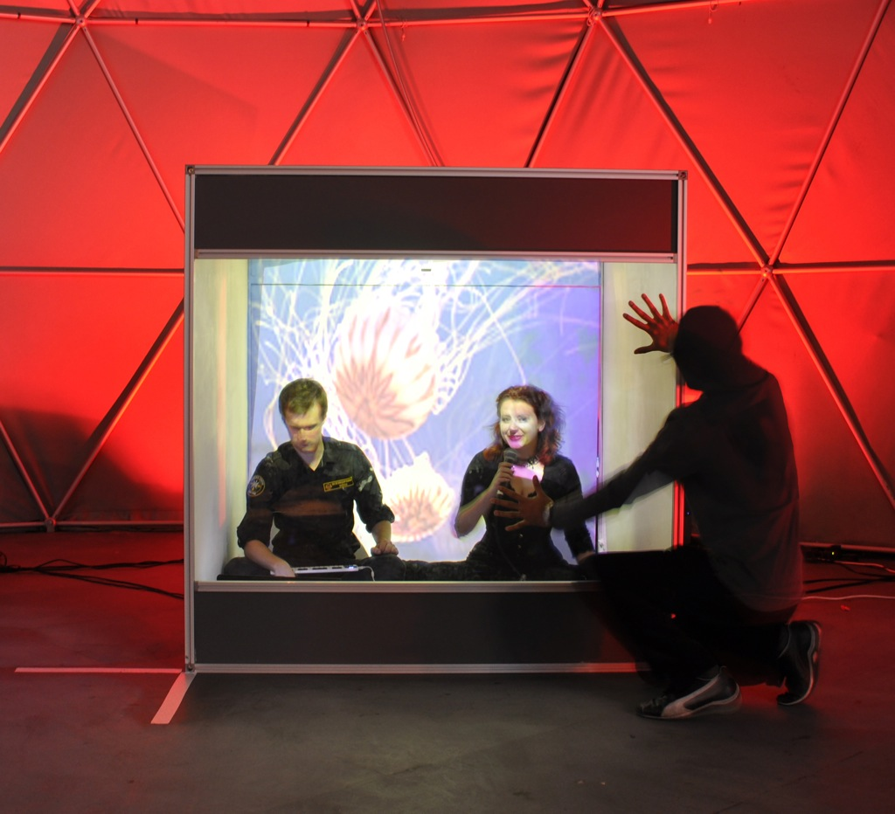
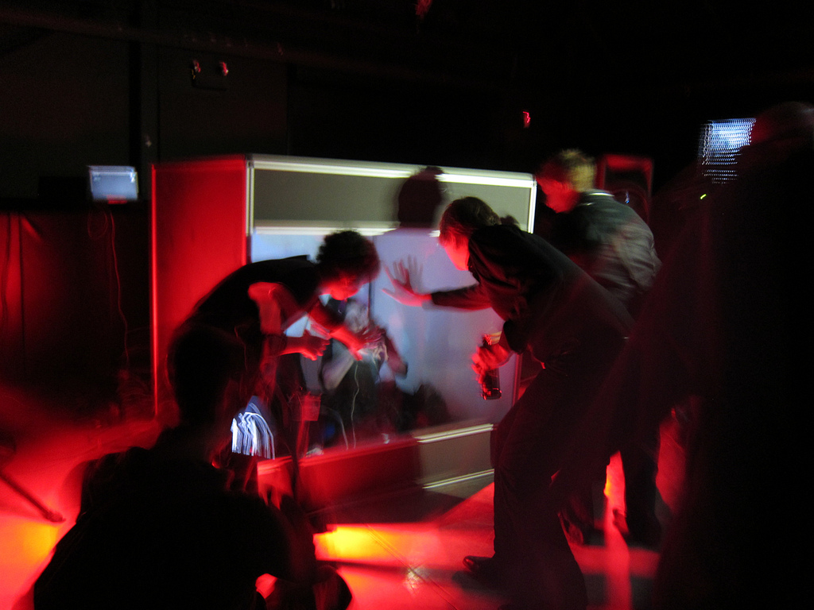
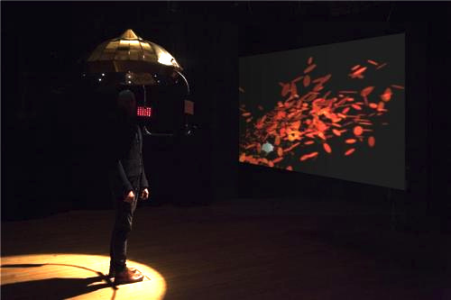

##TITLE
###AUTHOR - TITLE - Feb 26th 2015

##Links

- http://shearer12345.github.io/???
- source: https://github.com/shearer12345/???

##Structure

- ???
- ???
- ???

##*humanaquarium*

- exploring how interactive technologies can mediate participants' encounters and collaborations with live musicians
- developed & refined over a year's worth of public performances (2009-2011) at 12 different international venues

##Nightingallery

- an interactive musical installation featuring an animatronic bird that talks and sings, engaging members of the public in playful dialogue

###Research practice

- part of a research practice that explores social behaviour in public performance spaces through the enactment and examination of interactive, performance-based artworks
- performances
  - BBC Free-thinking (concert and lecture series)
  - Bestival
  - MakerFaire
  - Jam46 (Culture Lab works-in-progress show)
  - Dorkbot at the International Centre For Life
  - British HCI conference

####Performing and Music-Making

- how participants were able to use the Nightingallery installation to explicitly perform and engage in music-making activities

- Participants rapidly discovered that even speaking or singing quietly would still cause the bird to respond with an audible musical birdsong corresponding to what they had said or sung
- Shy participants could thereby allow the bird to do the performing rather than risk being heard singing themselves, often cupping their hands over the microphone so that their own vocal contributions were inaudible to others sharing the space.

##EyeResonator

- interactive art ecosystem that engages viewers by responding to their eye movements
- detects behavioural changes of the person and subsequently coaxes viewers' self-observation.
> about the meditative experience ... the technology is simply a tool for creating this

