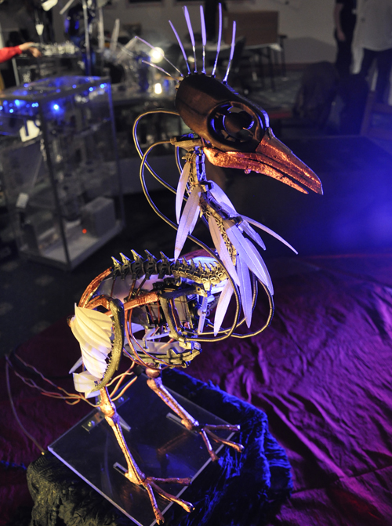
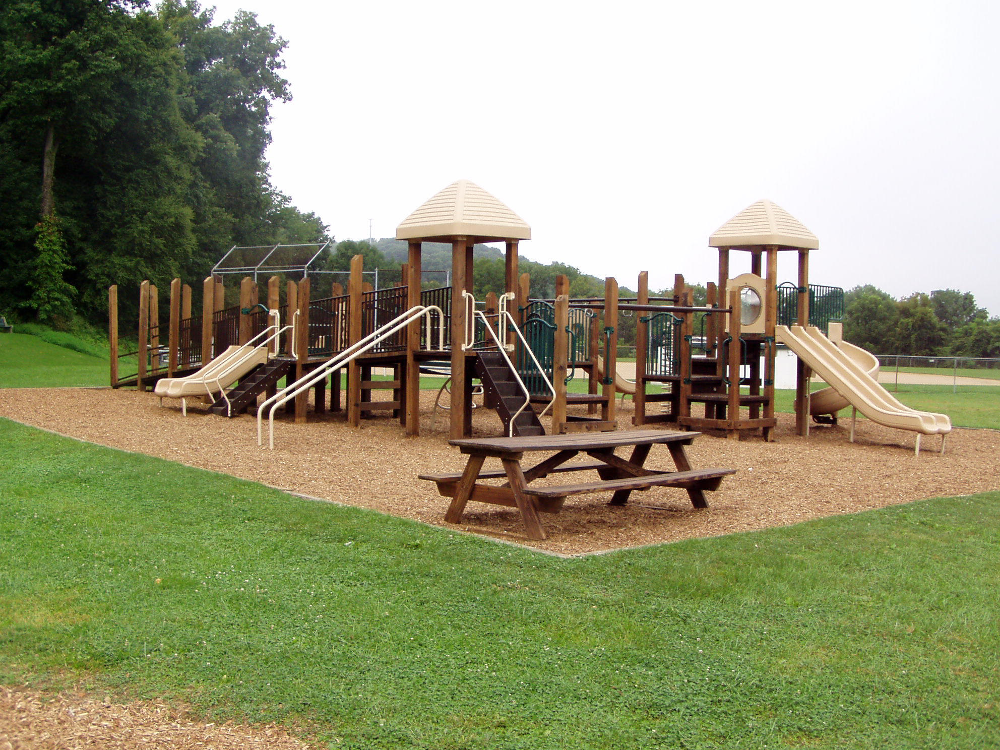
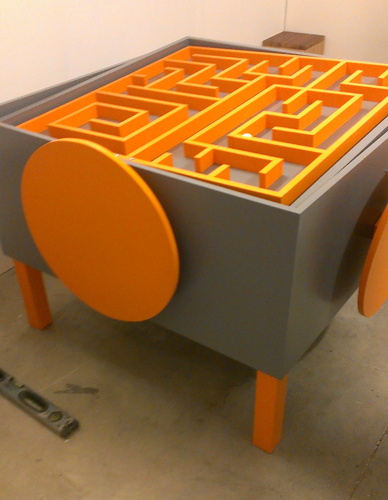

##Creative Play in Public Spaces

###Feb 26th 2015

##Structure

- Who am I
- Teaching
- Research
- ExhibitForge
- Future

#Who am I

##Who am I

- Dr. John Shearer
- Senior Lecturer in Games Computing
- Programme Leader Games Computing
- Lincoln Social Computing Research Centre
- University of Lincoln
- http://staff.lincoln.ac.uk/jshearer
- email:  jshearer@lincoln.ac.uk

##Previous

- Post-Doc - Digital Interaction @ Culture Lab, Newcastle
- PhD (Computer Science), Newcastle University
  -  Persuasive, interactive non-verbal behaviour in virtual characters
- BEng (Computer Science), York University

<!--img src="assets/york_logo_blue.jpg" alt="york_logo_blue.jpg" height="75"-->

##Links

- http://shearer12345.github.io/talk2015Feb_Seoul
- source: https://github.com/shearer12345/talk2015Feb_Seoul

#Teaching

- Senior Lecturer in Games Computing
- Programme Leader Games Computing
  - http://www.lincoln.ac.uk/home/course/cgpcmpub/
  - BSc (Hons), MComp
  - Full-time:  3-4 Years
  - ~200 Undergraduate Students
- Enthusiastic for relationships with Korea:
  - Taught programmes
  - Research programmes

##Modules

- Computer Graphics
- Games Computing
- Software Engineering
- Physical Computing

##Pedagogy / Philosophy

- Open (free)
- Open (open source)
- Collaborative & Dialogical
- Games Jams / HackFests / ...
- Games Incubation / Starup

#Research

##Creative Play in Public Spaces and ...

##*humanaquarium*

- exploring how interactive technologies can mediate participants' encounters and collaborations with live musicians
- developed & refined over a year's worth of public performances (2009-2011) at 12 different international venues

##Nightingallery

- an interactive musical installation featuring an animatronic bird that talks and sings, engaging members of the public in playful dialogue

##Eye Resonator

- interactive art ecosystem that engages viewers by responding to their eye movements
- detects behavioural changes of the person and subsequently coaxes viewers' self-observation.
> about the meditative experience ... the technology is simply a tool to create this

##My Great North Run

- museum-based
- multi-modal, multi-user
- educational and social engagement
- on-site and online

##Multiple Errands

- working with NHS and neurocog.co.uk
  - validate the Computerised Multiple Errands Test (C-MET Millar, Shearer & Evans)
- participant carrying out a number of tasks within a virtual shopping centre
- to assess, multitasking, planning and prospective memory ability.

#ExhibitForge

- Managing Director
- On-site Exhibit Support
  - Make
  - Maintain
  - Monitor

##Make

Bespoke interactive exhibits designed in collaboration with your domain experts. We aim to deeply understand your environment and requirements so that we can provide excellent, sustainable exhibits that align beautifully with your existing visitor experience.

##Maintain

- Rapid response on-site support and maintenance for exhibits and infrastructure.
- Wide diagnostic experience allows us to fix faults quickly and effectively.

##Monitor

- live monitoring of exhibits
- usage statistics to help guide your budget spending & diagnose faults and quickly learn of issues from anywhere using on-line portal
- online issue management system

##Metal to Cloud

- standard, scalable open source server management infrastructure
  - theforeman
  - saltstack, puppet

##Great North Museum

#Future

...

##Multiple Errands 2

- migrate from NeoAxis Engine, to:
  - 100% web-based
  - Android app
- server-side data recording
- server-side configuration of studies
- embedded questionnaires and logging
- clinical validation

##Droplets

- location-based, audio micro-story telling

##EMuE: Enhancing Museum Experiences

- using iBeacons to enhance museum experiences
  - at Royal Albert Memorial Museum, Exeter, UK

##Playground Games

- Combining play in playgrounds with engagement with the local ecology
  - learning about the local ecology

##Physical, Collaborative Games

##Games Collectives / Incubators

- Supporting indie-games community
- Supporting startup games companies
- Facilitating networking and learning

##Games in Public Spaces

- source = www.graeme-peacock.com

##British HCI

http://hci2015.bcs.org/

##Collaborations with YOU

- teaching
- research
- commercial
- games
- art
- ...

#THANK YOU

- http://shearer12345.github.io/talk2015Feb_Seoul
- http://staff.lincoln.ac.uk/jshearer
- email:  jshearer@lincoln.ac.uk

